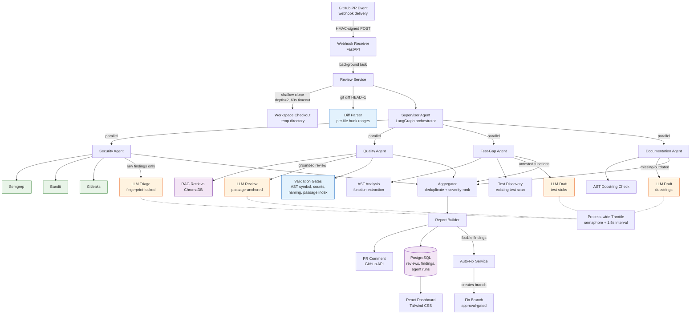
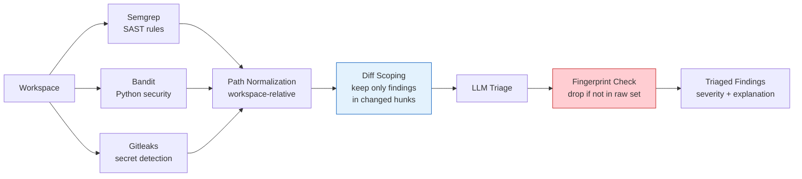

# CodeGuardian AI — Architecture

## Data Flow Summary

1. **Trigger**: GitHub delivers a `pull_request` webhook (HMAC-verified).
2. **Checkout**: Shallow clone (depth=2) into a temp directory; diff extracted via `git diff HEAD~1`.
3. **Fan-out**: Supervisor dispatches all 4 agents in parallel.
4. **Scan**: Security Agent runs 3 deterministic scanners; findings scoped to diff hunks.
5. **Triage**: LLM explains/ranks scanner findings — fingerprint-locked (cannot invent findings).
6. **Review**: Quality Agent retrieves coding standards via RAG, reviews diff, validates via 6 gates.
7. **Gaps**: Test-Gap Agent identifies untested functions via AST analysis, drafts test stubs.
8. **Docs**: Documentation Agent flags missing docstrings, drafts replacements.
9. **Aggregate**: Supervisor deduplicates, severity-ranks, builds the PR comment.
10. **Persist**: Findings stored in PostgreSQL; surfaced in the React dashboard.
11. **Auto-fix**: Fixable findings can generate a branch (requires explicit human approval).

## Key Design Principles

| Principle | Implementation |
|-----------|---------------|
| LLM never originates findings | Security: fingerprint-locked triage. Quality: passage + symbol + gate anchoring. |
| Deterministic verification | 6 validation gates: passage index, symbol existence, file scope, countable claims, naming conventions, diff containment |
| Graceful degradation | Each agent reports OK or DEGRADED; one failure never blocks the others |
| Human stays in control | Auto-fix branch requires explicit approval before merge |
| Rate-limit resilience | Process-wide semaphore + 1.5s minimum interval between LLM calls |

## Security Agent Detail

## Quality Agent Detail

```mermaid
flowchart LR
    DIFF[PR Diff] --> FACTS[AST Structural Facts<br/>functions, classes, lengths]
    FACTS --> QUERY[Retrieval Query]
    QUERY --> CHROMA[(ChromaDB<br/>coding standards)]
    CHROMA --> PASSAGES[Retrieved Passages]

    DIFF --> LLM[LLM Review<br/>diff + passages]
    PASSAGES --> LLM

    LLM --> G1[Gate 1: Passage Index<br/>must cite retrieved passage]
    G1 --> G2[Gate 2: Symbol Named<br/>non-empty]
    G2 --> G3[Gate 3: File in PR<br/>changed files only]
    G3 --> G4[Gate 4: Symbol Exists<br/>AST lookup]
    G4 --> G5[Gate 5: Countable Claims<br/>line count, param count]
    G5 --> G6[Gate 6: Naming Claims<br/>snake_case / PascalCase<br/>verified against AST]
    G6 --> OUT[Accepted Findings]

    style G1 fill:#e3f2fd,stroke:#1565c0
    style G2 fill:#e3f2fd,stroke:#1565c0
    style G3 fill:#e3f2fd,stroke:#1565c0
    style G4 fill:#e3f2fd,stroke:#1565c0
    style G5 fill:#e3f2fd,stroke:#1565c0
    style G6 fill:#e3f2fd,stroke:#1565c0
```

